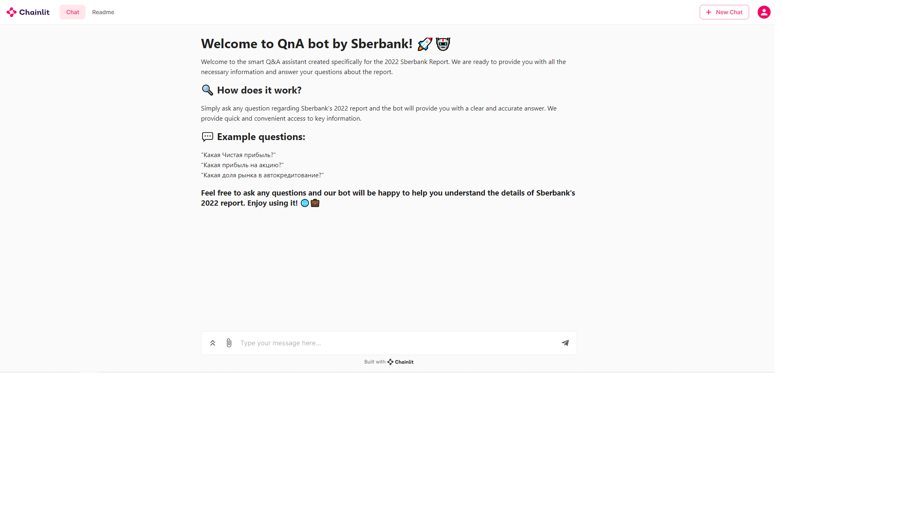
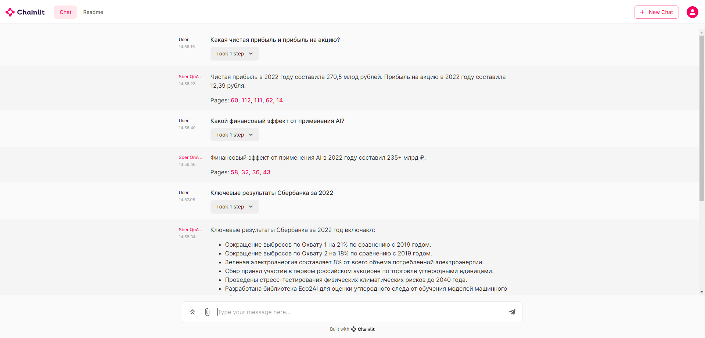

# QnA-pdf-bot-sberbank


## 🧰 Stack

- [Python](https://www.python.org/downloads/release/python-3100/)
- [Langchain](https://python.langchain.com/docs/get_started/introduction.html)
- [Chainlit](https://docs.chainlit.io/overview)
- [Chroma](https://www.trychroma.com/)
- [OpenAI](https://openai.com/)

# WARNING!!!

If you are in Russia or a country where openAI api is not available **use VPN**.

## 💻  Getting Started
1. Clone the repository📂
```bash
git clone https://github.com/Motoroller89/QnA-pdf-bot-sberbank.git
cd QnA-pdf-bot-sberbank
```
2. Install the required Python packages:
```bash
pip install -r requirements.txt
```
3. Create a .env file and input your OpenAI API Key in the file
```bash
cp .env.example .env
```
4. Run the Chainlit server🚀
```bash
chainlit run app.py
```

## 🐳  Docker quick start
1. Clone the repository📂
```bash
git clone https://github.com/Motoroller89/QnA-pdf-bot-sberbank.git
cd QnA-pdf-bot-sberbank
```
2. Build the docker container and setup OpenAI api key:
```bash
docker build -t sber:last --build-arg OPENAI_API_KEY=your-open-ai-api-key .
```
3. Run the docker container directly
```bash
docker run -it sber:last
```


## 📖 Example Usage

